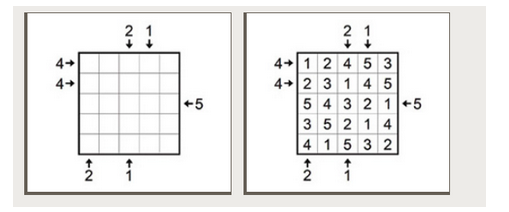
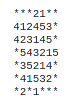

## First lab, second semester OP

this code helps to define whether the combination of the pole is winning or not

## This is an example of a winning combination

## This is how the desk should be entered in a txt file

